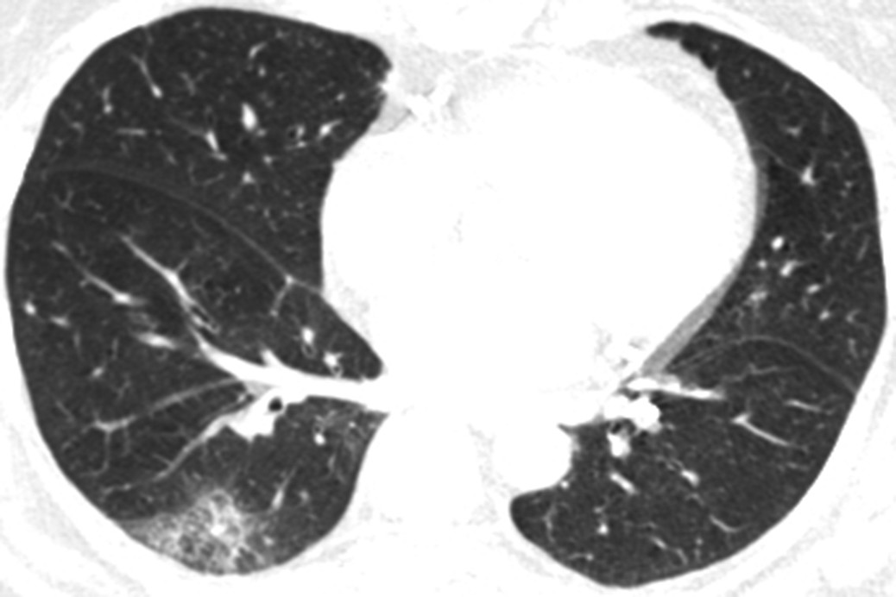
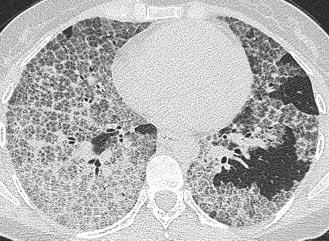
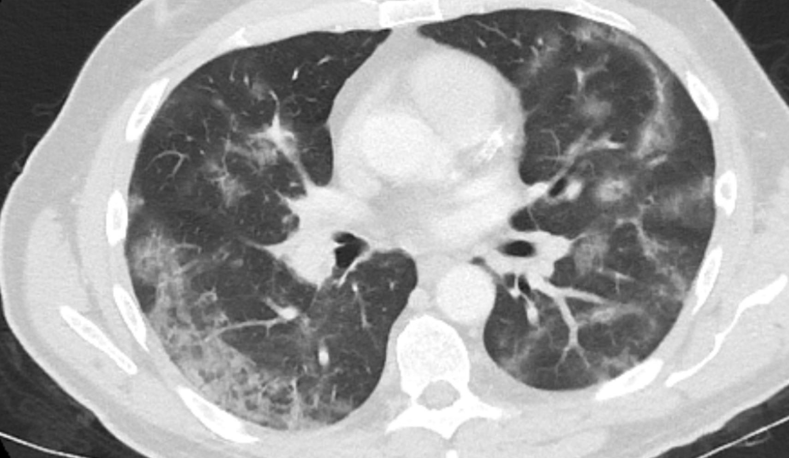

<link href="style.css" rel="stylesheet"></link>

# Idiot's Guide to Covid-19 HRCT reporting.

***At the time of writing the literature on SARS-Cov-2 infection is dominated by small descriptive studies mostly coming out of Wuhan in China. There are significant differences in age (average in many papers = 40 to 50yrs), background morbidity, medical practice and culture which will alter how this disease will present, be interpreted and will probably alter what the findings on radiology are. So, don't expect our experience over the next few months to be the same.***

## **Table of Contents**
<!-- TOC -->
- [Idiot's Guide to Covid-19 HRCT reporting.](#idiots-guide-to-covid-19-hrct-reporting)
  - [**Table of Contents**](#table-of-contents)
  - [**Clinical Features**](#clinical-features)
      - [Symptoms and Signs](#symptoms-and-signs)
      - [Timescales](#timescales)
  - [**Presentation: CXR features**](#presentation-cxr-features)
  - [**Presentation: HRCT**](#presentation-hrct)
    - [**Classical Features.**](#classical-features)
  - [**Change over time.**](#change-over-time)
  - [**Pathway**](#pathway)
  - [**Reports**](#reports)
    - [**CXR** _(feel free to cut and paste)_](#cxr-feel-free-to-cut-and-paste)
    - [**HRCT**](#hrct)
  - [**Not such important stuff.**](#not-such-important-stuff)
      - [Reticulation](#reticulation)
      - [Vascular Enlargement](#vascular-enlargement)
      - [Crazy Paving](#crazy-paving)
      - [Adult Respiratory Distress Syndrome / Diffuse Alveolar Damage](#adult-respiratory-distress-syndrome--diffuse-alveolar-damage)
      - [Organising Pneumonia](#organising-pneumonia)
      - [Perilobular](#perilobular)
      - [Reversed Halo and Atolls](#reversed-halo-and-atolls)
      - [Bandlike changes & Dependent changes.](#bandlike-changes--dependent-changes)
  - [**Covid-19 resources**](#covid-19-resources)
      - [General](#general)
      - [Image Galleries](#image-galleries)
      - [Colleges / Associations / Journals](#colleges--associations--journals)
  - [**HRCT appearances of other things**](#hrct-appearances-of-other-things)
  - [**Bibliography & References**](#bibliography--references)
  - [**Other Images**](#other-images)

## **Clinical Features**
#### Symptoms and Signs

* Variable : Asymptomatic to ARDS with Multiorgan failure.
  * ~80% Mild
  * ~20% Need admission
  * ~5% Need ventilation
  * 73% of positives on Corona Princess were asymptomatic but 53% of these had ground glass opacities on CT Chest.
* Presenting Features:
  1. Common
     * Fever
     * Cough
     * Lethargy
  2. Less Common
     * Shortness of breath (normally develops after the cough / fever.)
     * Loss of Smell and / or Taste
     * Pain - can be muscular and / or headache.
     * Diarrhoea and vomiting.

* Predictors of severe illness / death
  * Age
  * Co-morbidities
    * Cardiovascular disease
    * Diabetes
    * Hypertension
    * Chronic respiratory disease
  * Sex M > F
  * _Raised BMI_
  * _Poor Functional Status_

* Clinical predictors of severe illness / death
  * low SaO2 on room air.
  * Raised LDH
  * Raised CRP 
  * Low lymphocytes

#### Timescales 

   * Mild: generally resolve over 1/52. (cough can be many weeks)
   * Severe cases: generally progress over 7-10 days. Many will be in ITU at this point.
   * 90% of deaths are from 10th to 28th day; peaking at Day 14.

Changes on HRCT are described soon after onset, so we may expect to see abnormalities on most of the referral but only 55% of patients had abnormalities on HRCT from day 0-2 of infection.

____

## **Presentation: CXR features**

These will be the first investigation and there is NO direct to HRCT!

The role is twofold:
1. Identify the other causes of acute SoB.
   * Lobar, or at least unilateral consolidation and other features of infection . _Covid-19 is rarely simultaneously obvious AND unilateral._
   * Pneumothorax. _Should be obvious._
   * Pulmonary oedema. _Pleural effusions are unusual in Covid-19 infection and rare at presentation as are marked interstitial changes._

2. Positively identify the classical features of Covid-19 infection.
   * Patchy, bilateral airspace changes
   * Mostly subtle as more ground glass than consolidation.  
   
   Combined with a decent history and other predictive elements ( Lymphopenia and / or Fever ) this has an adequate post-test probability to move straight into isolation without the need for a CT .  
   This leaves a large group of patients with normal CXRs and good histories or patients with reasonable or good histories and some, but not specific CXR findings. For instance infective exacerbation of COPD. These patients will need an HRCT.

_CXR in patient presenting with Covid-19 infection - note the patchy, ill-defined, mostly peripheral regions of increased attenuation worse on the right than the left._

_CXRs demonstrating changes seen at presentation:  A= (patchy) consolidation 59%  B= pleural effusion 3%  C= perihilar distribution 12%  D= peripheral distribution 51%._

---

## **Presentation: HRCT**

  * Non contrast whole chest HRCT as per protocol.
  * With contrast is fine; changes are not so subtle.
  * Chest has been added to acute abdomen CT A/P as:
    * CoVID-19 can present with confusion / falls and be incidental.
    * Positive patients are high mortality risk but also high risk to the surgeons \& others in theatre.
  
### **Classical Features.**

1. Ground-glass opacities :  
   * Small and patchy > Large and Solitary  
   * Basal > Apical and Posterior > Anterior.  
   * Consolidation - nearly always in combination with the ground-glass opacities, rarely on its own.  
  
2. Err that is about it in terms of 'classical features' . Without ground-glass / mixed opacities it is unlikely to be Covid-19 and of course there are multiple virus and other pathogens and insults that can cause this so it is non-specific. 

 

_Typical CT at presentation with moderate size airspace opacities, which are bilateral, basal and mostly peripheral._  

Then there are **NOT-CLASSICAL APPEARANCES** or occasional features often seen further into the course of the illness.

1. Reticulation in association with the nodules
1. Round opacities > linear opacities
2. Vascular prominence. 
3. Crazy-paving / Perilobular changes. 
4. Reverse Halo / Atoll sign - though this is rare.

Then there are the **NOT** signs may not be related to COVID-19 and may push the differential toward something else.

1. Cavitation 
2. Pleural effusion
3. Thoracic lymphadenopathy
4. Bronchial wall thickening is seen in a minority but mostly late and might be chronic. 
5. Widespread fibrosis.

>**NB**  
> Background changes ( emphysema, fibrosis etc ) are common and might predict worse prognosis.  
> The literature on the 'occasional' findings is heterogeneous. 
>   e.g. 'reticulation' - some papers say 0% at presentation, others 40 to 80%. 

 
_CT at presentation demonstrating subtle change which progressed on subsequent CTs - if asymptomatic or mild and / or early in disease then the changes can be minimal._

_CT at presentation demonstrating more established change but slightly atypical change. There is certainly reticulation and one could mention perilobular or reversed halo. Subsequent CTs demonstrated more foci of ground glass opacity._

---

## **Change over time.**
 
  - Several papers now document changes out to a month. 
    - hampered by variability in practice, timings and record of findings as well as interpretation.
    - general description of both fatal and non-fatal severe infection is developing.

**Non-fatal progression and resolution of severe infection**  

| Phase | Days | Findings |
| ------ |-----|-------|
|Early | 0-4 | None ( esp 0-2 days) Low volume, subpleural, lower lobe GGOs. Unilateral or bilateral|
|Progressive | 5-8 | Rapid increase in size and number to bilateral multilobed with diffuse GGO. Consolidation and crazy-paving described.
|Peak | 9-13 | No new lesions. Increase in attenuation in lesions now with dense consolidation Crazy-paving and parenchymal bands more common.|
|Absorption | 14-28 | Gradual resorption of consolidation. Appears to be more GGO as the consolidation reduces. No crazy paving.|

90% + of scans carried out at Day 24-28 will be abnormal - mostly still some airspace change. 

_CT series of a 47yo female demonstrating the changes and resolution of a covid-19 infection.  A= 3 days post onset, B = 7 days post onset, C = 11 days post onset with signs of improvement which is early, D= 20 days_

_CT series of a 35yo female with Covid-19 pneumonia. A= Day 0, B= Day 5, C= Day 11, D= Day 15 post onset._

**Fatal and very severe infection**

 - The changes here are not so well described. Either:
   1. Pneumonia +/- other morbidities => Respiratory failure & Death 💀 Or, 
   2. Adult Respiratory Distress syndrome intervenes normally around or after day 10. Please see below for a description of ARDS.
      
      . Other organs can also be involved in severe disease including small vessels of the heart and the myocardium itself.

 - CT changes associated with worse clinical status on admission include
   - Diffuse vs focal/multifocal distibution.
   - CT severity score ( = number of lobes x extent of lobe involvement)
   - _architectural distortion, effusions, traction bronchiectasis are also described as predicting more severe disease_  
 - Thus, we might expect to describe severe, progressive disease in terms of:
   - Large volumes of abnormality either at presentation or follow up.
   - Development of new lesions after about day 10-14 - ? secondary infection or just progressive covid-19.
   - Failure of any sign of resolution after about 14-21 days
   - Development of signs of other pathology such as cardiogenic pulmonary oedema. 

----

## **Pathway**
we are following the BSTI pathway.

----
## **Reports**
as per the BSTI/BSUH reporting proforma:

### **CXR** _(feel free to cut and paste)_

|Classification|Findings|REPORT MUST SAY|
|:----|----|----|
|Normal| The airspaces are clear. | **Normal**  COVID-19 not excluded. Correlate with RT-PCR and if there is a strong clinical  suspicion of COVID-19 ( eg sats <94% or NEWS >=3 ) then consider HRCT.|
|Other Diagnosis| Radiological findings in keeping with another diagnosis that fits the presentation. (PTx/Lobar pneumonia/pleural effusion/pulmonary oedema/etc)| **Non-COVID-19**  Imaging appearances are in keeping with a non-COVID-19 diagnosis.|
|Indeterminate| Is not normal, classical COVID nor another classical diagnosis.| **Indeterminate for COVID-19** Does not fit with Classic or Non-Covid-19. Please assess the patient with all available data.|
|Classical or Probable COVID-19| Multiple airspace opacities which are mostly lower lobe and/or peripheral and bilateral.| **Classic/Probable COVID-19**. Please isolate and treat as appropriate|

### **HRCT**

|Section|Findings|REPORT WILL/MUST SAY|
|:----|:----|:----|
|**Pre-existing lung findings**|None Emphysema Fibrosis |None Emphysema: none/mild/moderate/severe Fibrosis: none/mild/moderate/severe|
|**Findings**|||
||***Normal*** Normal HRCT No acute change on background abnormality| No acute changes consistent with COVID-19 infection|
||***Classic/Probable COVID-19*** Dominant pattern of ground-glass opacities +/- consolidation. Often bilateral, posterior and basal. +/- crazy-paving/reverse halo/perilobular change|eg "There are several peripheral ground-glass opacities  which are mostly in the posterobasal parts of both  lungs with foci of consolidation and crazy-paving noted"|
||***Indeterminate for COVID-19*** Does not fit classic COVID-19 pattern or non-COVID-19 pattern or clinical context. Include non-peripheral GGO/ marked unilateral change etc.|eg "There is a focus of ground glass opacity centrally on the left"|
||***Non-COVID-19*** Changes not associated with COVID-19 but sugestive of other differentials Include lobar pneumonia/cavitation/tree-in-bud/centrilobular nodules/lymphadenopathy etc|eg "There are multiple regions of centrilobular nodules and  tree-in-bud change more in keeping with xxx and these are  not changes described with COVID-19 infection"|
|**Disease Distribution**| Describe the predominant distribution|Upper / Middle / Lower / Random Central 2/3rds / Peripheral 1/3rd Bronchocentric ( y / n )  |
|**Other findings**|Heart / mediastinum / pleura / chest wall etc|eg "No other significant abnormality seen" "Note is made of cardiomegaly / pleural effusion" etc|
|**CONCLUSION:**|||
||***Normal***|**Normal**  Correlate with rt-PCR as CT can be normal early in infecton|
||***Classic/Probable COVID-19 Diagnosis*** Assess _CT severity score_ Mild = Pure GGO, <=3 focal abnormalities and ALL <= 3cm Mod/Severe = Consolidation, Pure GGO if > 3 and any >3cm, Architectural distortion|**Classic/Probable COVID-19 Diagnosis** CT severity score = Mild or Moderate/Severe.|
||***Indeterminate COVID-19 diagnosis***|**Indeterminate COVID-19 diagnosis** Clinical review with all the data is advised|
||***Non-COVID-19 diagnosis***|**Non-COVID-19 diagnosis** Correlate with rt-PCR as CT can be normal in early infection|

---

## **Not such important stuff.**
 - lots of terminology is banded around which can lead to confusion:

#### Reticulation
   - If, you look closely at the areas of ground glass there will be really tiny lines in them (intralobular) or slightly bigger hexagonal shapes or lines (interlobular).
   - the literature is variable in the frequency and timing of reticulation so don't fret over it. 

#### Vascular Enlargement
- not an easy thing to call, would not worry about it.
- not really described with other pathologies and not an established fact. 

_hmm, yeah clearly that vessel is larger than I expect it to be_ 🤔

#### Crazy Paving
- is ground glass defined by thickened interlobular septa usually with intralobular septal thickening as well.
- fairly common in mid to late phase disease.

    

#### Adult Respiratory Distress Syndrome / Diffuse Alveolar Damage
  * Or, as they are better known, ARDS and DAD are essentially the same thing with DAD being the pathological findings which define the clinical syndrome, ARDS.
  * End point of a range of major insults (not just CoVID) which include infections, trauma, sepsis. 
   
      
  * 3 Stages: 
    * EXUDATIVE: alveoli become oedematous then necrosis with haemorrhage.
    * PROLIFERATIVE: 1/52-1/12: Type II pneumocytes invade and proliferate and produce collagen.
    * FIBROTIC: >1/12: reduction in infiltrate left with interstitial fibrosis. 
  * Radiology - follows the pathology a bit but mostly lots of ground-glass with dependent regions being more consolidative. So not really distinguishable from a severe infection. Pulmonary oedema generally has more interstitial lines in the acute phase.
  * Intensive care clinicians are the best at diagnosing this( sure I saw a mention of a paper recently where their clinical opinion outperformed an ML model ) and will probably tell you this on the form - or at least hint. 

#### Organising Pneumonia 
- utterly confusing terminology used here to describe an HRCT appearance but elsewhere is used to describe a pathological finding which is associated with several different insults (infection, collagen vascular disease, hypersensitivity) and clinical syndromes.
- best through of as 'pneumonia that has organised' - so it has been there for a bit and changed in some way - and best described as 'organising pneumonia pattern' or 'picture'. It is generally appreciated in COVID-19 infection some days after symptom onset.  

    

- generally it consists of peripheral airspace change which can be peribronchial, often associated with certain shapes so 'rounded' or ' linear'and distributions such as perilobular as well as unusual patterns such as reversed halo or atoll signs. (see below)

#### Perilobular 
- describes changes around the border of the secondary lobule which exceed the linear thickening seen with 'interlobular thickening
- mostly due to changes around the outer edge of the lobule rather than changes in the interlobular septum.
  
    

- seen in covid-19 as part of 'organising pneumonia pattern'

#### Reversed Halo and Atolls
- describe the same phenomenon and consist of normal (or less abnormal) lung surrounded by consolidative lung which is either a ring (=halo) or not quite complete (=atoll).
- seen in Covid-19 as part of the 'organising pneumonia picture'.

  
  
#### Bandlike changes & Dependent changes.
- can be confusing and tricky to say if an abnormality in a dependent part of lung is due to dependency or real pathology at the best of times. 
- made all the more confusing by some literature referring to 'bandlike' opacities in Covid-19.

    

    _bandlike opacity in the posterior right lung in a Covid-19 patient: note no volume loss, well defined focal lesion_

    

    _dependent change: note more linear and wider distributed with some volume loss_

----

## **Covid-19 resources**

#### General 

  - [Covid-19 at Dynamed](https://www.dynamed.com/condition/covid-19-novel-coronavirus#TOPIC_XNV_WR5_PKB__LI_JH4_2QJ_4KB)

#### Image Galleries

  - [RADIOLOGY](https://pubs.rsna.org/2019-ncov)
  - [BSTI](https://www.bsti.org.uk/)
  - [STR Videos](https://veritastv.org/programs/covid-19)

#### Colleges / Associations / Journals

  - [AJR](https://www.ajronline.org/topic/cov19)
  - [RCR](https://www.rcr.ac.uk/college/coronavirus-covid-19-what-rcr-doing)
  - [RANZCR](https://www.ranzcr.com/our-work/coronavirus/resources-and-useful-links)
  - [NEJM](https://www.nejm.org/coronavirus)
  - [Lancet](https://www.thelancet.com/coronavirus) 

---

## **HRCT appearances of other things**

**UIP / CFA**

_usual interstital pneumonia is the histological findings in patients with cryptogenic fibrosing alveolitis._ 

**Pulmonary oedema**

_pleural effusions and nice demonstration of interlobular septal thickening is someone with gross fluid overload._

---

## **Bibliography & References**
all the above and all the images are derived from the following sources _sorry for not attributing properly yet._

    1.Wong HYF, Lam HYS, Fong AH-T, et al. Frequency and Distribution of Chest Radiographic Findings in COVID-19 Positive Patients. Radiology 2020. https://doi.org/https://doi.org/10.1148/radiol.2020201160.
  
    2.Lu X, Zhang L, Du H, et al. SARS-CoV-2 Infection in Children. New England Journal of Medicine 2020;0(0):null. https://doi.org/10.1056/NEJMc2005073.
  
    3.COVID-19 (Novel Coronavirus) n.d. https://www.dynamed.com/condition/covid-19-novel-coronavirus (accessed March 29, 2020).
  
    4.Clinical course and risk factors for mortality of adult inpatients with COVID-19 in Wuhan, China: a retrospective cohort study- ClinicalKey n.d. https://www.clinicalkey.com/#!/content/journal/1-s2.0-S0140673620305663 (accessed March 29, 2020).
  
    5.Daniel Kaul MD. Risk Factors for ARDS and Progression to Death Among COVID-19 Patients. NEJM Journal Watch 2020;2020. https://doi.org/10.1056/nejm-jw.NA51132.
  
    6.Shi H, Han X, Jiang N, et al. Radiological findings from 81 patients with COVID-19 pneumonia in Wuhan, China: a descriptive study. The Lancet Infectious Diseases 2020;20(4):425–34. https://doi.org/10.1016/S1473-3099(20)30086-4.
  
    7.COVID-19: consider cytokine storm syndromes and immunosuppression- ClinicalKey n.d. https://www.clinicalkey.com/#!/content/journal/1-s2.0-S0140673620306280 (accessed March 29, 2020).
  
    8.Zhao W, Zhong Z, Xie X, Yu Q, Liu J. Relation Between Chest CT Findings and Clinical Conditions of Coronavirus Disease (COVID-19) Pneumonia: A Multicenter Study. American Journal of Roentgenology 2020:1–6. https://doi.org/10.2214/AJR.20.22976.
  
    9.Li Y, Xia L. Coronavirus Disease 2019 (COVID-19): Role of Chest CT in Diagnosis and Management. American Journal of Roentgenology 2020:1–7. https://doi.org/10.2214/AJR.20.22954.
  
    10.Salehi S, Abedi A, Balakrishnan S, Gholamrezanezhad A. Coronavirus Disease 2019 (COVID-19): A Systematic Review of Imaging Findings in 919 Patients. American Journal of Roentgenology 2020:1–7. https://doi.org/10.2214/AJR.20.23034.
  
    11.Cheng Z, Lu Y, Cao Q, et al. Clinical Features and Chest CT Manifestations of Coronavirus Disease 2019 (COVID-19) in a Single-Center Study in Shanghai, China. American Journal of Roentgenology 2020:1–6. https://doi.org/10.2214/AJR.20.22959.
  
    12.Han R, Huang L, Jiang H, Dong J, Peng H, Zhang D. Early Clinical and CT Manifestations of Coronavirus Disease 2019 (COVID-19) Pneumonia. American Journal of Roentgenology 2020:1–6. https://doi.org/10.2214/AJR.20.22961.
  
    13.Liu D, Li L, Wu X, et al. Pregnancy and Perinatal Outcomes of Women With Coronavirus Disease (COVID-19) Pneumonia: A Preliminary Analysis. American Journal of Roentgenology 2020:1–6. https://doi.org/10.2214/AJR.20.23072.
  
    14.Guan W, Liu J, Yu C. CT Findings of Coronavirus Disease (COVID-19) Severe Pneumonia. American Journal of Roentgenology 2020:W1–2. https://doi.org/10.2214/AJR.20.23035.
  
    15.Ng M-Y, Lee EY, Yang J, et al. Imaging Profile of the COVID-19 Infection: Radiologic Findings and Literature Review. Radiology: Cardiothoracic Imaging 2020;2(1):e200034. https://doi.org/10.1148/ryct.2020200034.
  
    16.Pan F, Ye T, Sun P, et al. Time Course of Lung Changes On Chest CT During Recovery From 2019 Novel Coronavirus (COVID-19) Pneumonia. Radiology 2020:200370. https://doi.org/10.1148/radiol.2020200370.
  
    17.Ai T, Yang Z, Hou H, et al. Correlation of Chest CT and RT-PCR Testing in Coronavirus Disease 2019 (COVID-19) in China: A Report of 1014 Cases. Radiology 2020:200642. https://doi.org/10.1148/radiol.2020200642.
  
    18.Bai HX, Hsieh B, Xiong Z, et al. Performance of radiologists in differentiating COVID-19 from viral pneumonia on chest CT. Radiology 2020:200823. https://doi.org/10.1148/radiol.2020200823.
  
    19.Inui S, Fujikawa A, Jitsu M, et al. Chest CT Findings in Cases from the Cruise Ship “Diamond Princess” with Coronavirus Disease 2019 (COVID-19). Radiology: Cardiothoracic Imaging 2020;2(2):e200110. https://doi.org/10.1148/ryct.2020200110.
  
    20.Li L, Qin L, Xu Z, et al. Artificial Intelligence Distinguishes COVID-19 from Community Acquired Pneumonia on Chest CT. Radiology 2020:200905. https://doi.org/10.1148/radiol.2020200905.
  
    21.Wong HYF, Lam HYS, Fong AH-T, et al. Frequency and Distribution of Chest Radiographic Findings in COVID-19 Positive Patients. Radiology 2020:201160. https://doi.org/10.1148/radiol.2020201160.
  
    22.Wang Y, Dong C, Hu Y, et al. Temporal Changes of CT Findings in 90 Patients with COVID-19 Pneumonia: A Longitudinal Study. Radiology 2020:200843. https://doi.org/10.1148/radiol.2020200843.
  
    23.Bernheim A, Mei X, Huang M, et al. Chest CT Findings in Coronavirus Disease-19 (COVID-19): Relationship to Duration of Infection. Radiology 2020:200463. https://doi.org/10.1148/radiol.2020200463.
  
    24.Hansell DM, Bankier AA, MacMahon H, McLoud TC, Müller NL, Remy J. Fleischner Society: Glossary of Terms for Thoracic Imaging. Radiology 2008;246(3):697–722. https://doi.org/10.1148/radiol.2462070712.
  
    25.2019 Novel Coronavirus (COVID-19) n.d. https://pubs.rsna.org/2019-nCoV (accessed March 25, 2020).
  
    26.Kanne JP, Little BP, Chung JH, Elicker BM, Ketai LH. Essentials for Radiologists on COVID-19: An Update—Radiology Scientific Expert Panel. Radiology 2020:200527. https://doi.org/10.1148/radiol.2020200527.
  
    27.Helpful documents to plan COVID response | The Royal College of Radiologists n.d. https://www.rcr.ac.uk/network/helpful-documents-plan-covid-response (accessed March 25, 2020).
  

---

## **Other Images** 

